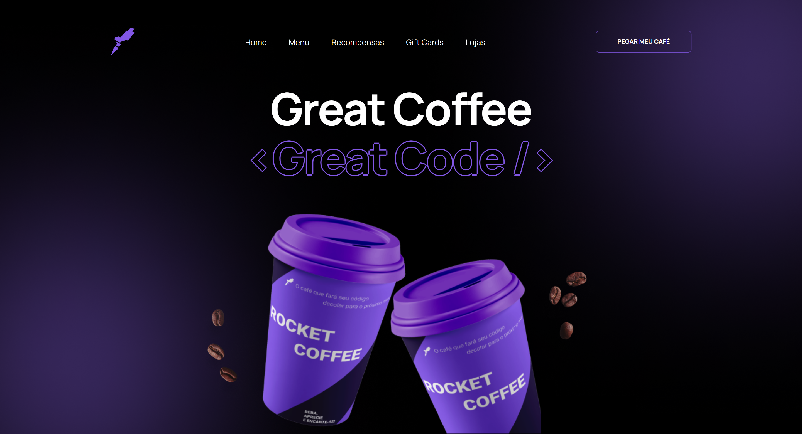

# RocketCoffee

  Preview:
    &nbsp;&nbsp;&nbsp;
  <a href="./preview/320x635">320x635</a>
    &nbsp;&nbsp;&nbsp;|&nbsp;&nbsp;&nbsp;
  <a href="./preview/375x635">375x635</a>
    &nbsp;&nbsp;&nbsp;|&nbsp;&nbsp;&nbsp;
  <a href="./preview/425x635">425x635</a>
    &nbsp;&nbsp;&nbsp;|&nbsp;&nbsp;&nbsp;
  <a href="./preview/1440x747">1440x747</a>

## Projeto 💻
Projeto de um desafio da Rocketseat de desenvolver uma homepage para uma marca de café.  
(https://www.figma.com/file/lQ59IS6f8VI026SrABKXqv/RocketCoffee-(Copy)?t=3fuZPtrYmCUy3Oz4-6)

## Instalação 🛠
Siga esses passos para instalar o repositório na sua máquina:
1. Rode `git clone https://github.com/miishiyama/RocketCoffee` para fazer um clone desse repositório.

## Tecnologias 🚀
As tecnologias utilizadas neste projeto são:
- HTML
- CSS
- JavaScript
- DOM
- Google Fonts
- Media Queries
- Keyframes

## Créditos ❤️
Feito por [Millene Eduarda Ishiyama](https://github.com/miishiyama/).
